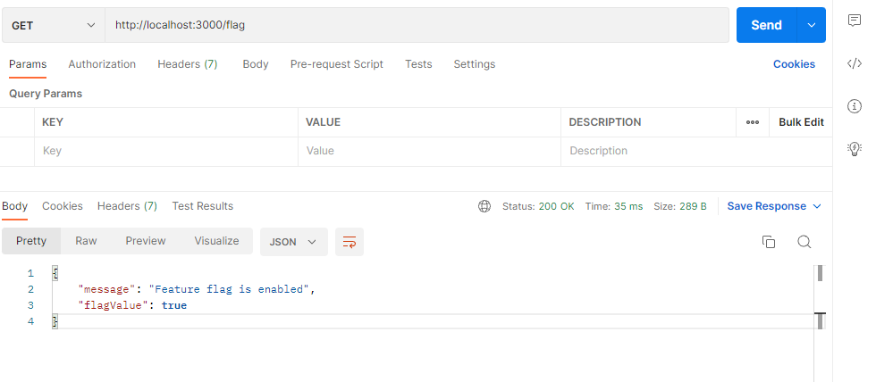

# Integration of LaunchDarkly in NestJS

This is a simple application which demonstrates the integration of Launch Darkly with the nest.js app.

## Prerequisites

Before you begin, ensure you have the following:

- A LaunchDarkly account: [Sign up here](https://launchdarkly.com/)
- An existing LaunchDarkly project
- Have the feature flag created in the LaunchDarkly dashboard: `show-feature-backend` or create a custom feature flag and replace the value of variable `feature_flag_key` with your feature flag value.

## Build instructions
1. Install the LaunchDarkly Node.js SDK and other dependencies by running 
```shell script 
npm install
```

2. Create `.env` file form copying `.env.sample` file on the root and provide the required details to run the server.

3. To Run the server
```shell script 
npm run start
```

To check whether the flag is enabled make a ``GET`` request to http://localhost:3000/flag via postman or any other platform. The result should look like this.
